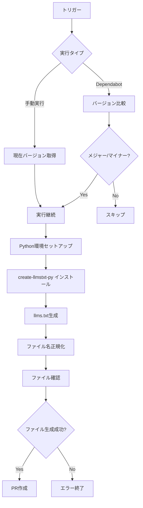

# Update Tailwind CSS llms.txt ワークフロー

## 概要

このGitHub Actionsワークフローは、Tailwind CSSのメジャー・マイナーバージョンアップデート時に自動でllms.txtファイルを生成・更新するためのものです。

**ファイル場所**: `.github/workflows/update-tailwind-llmstxt.yml`

## 機能

### 自動実行（Dependabot連携）
- DependabotによるTailwind CSSのPRがマージされた時に自動実行
- **メジャー・マイナーバージョンアップのみ**対応（パッチバージョンは除外）
- 自動でPRを作成し、生成されたllms.txtファイルを提案

### 手動実行
- GitHub ActionsのUIから手動実行可能
- カスタマイズ可能なパラメータ付き
- バージョン制限なし（常に実行）

## トリガー条件

### 自動実行
```yaml
on:
  pull_request:
    types: [closed]
    paths: ['package.json']
```

**実行条件**:
- Dependabotが作成したPRがマージされた
- `package.json`が変更されている
- Tailwind CSSがメジャー・マイナーバージョンアップされた

### 手動実行
```yaml
on:
  workflow_dispatch:
    inputs:
      force_update: # パッチバージョンでも強制実行
      max_urls: # 処理するURL数
```

## パラメータ

### `force_update` (boolean)
- **デフォルト**: `false`
- **説明**: パッチバージョンでも強制的にllms.txtを更新
- **使用例**: 緊急でドキュメント更新が必要な場合

### `max_urls` (string)
- **デフォルト**: `"10"`
- **説明**: create-llmstxt-pyが処理するURL数の上限
- **推奨値**: 
  - 通常: 10-50
  - 詳細: 50-100（処理時間が長くなる）

## 実行フロー



## 依存関係

### 必要なGitHub Secrets
以下のSecretsをリポジトリ設定で追加してください：

| Secret名 | 説明 | 取得方法 |
|----------|------|----------|
| `FIRECRAWL_API_KEY` | Firecrawl APIキー | [Firecrawl](https://firecrawl.dev/)でアカウント作成 |
| `OPENAI_API_KEY` | OpenAI APIキー | [OpenAI Platform](https://platform.openai.com/)でAPI key作成 |

### 外部ツール
- **create-llmstxt-py**: https://github.com/mendableai/create-llmstxt-py
- **Firecrawl API**: ウェブサイトクローリング
- **OpenAI API**: コンテンツ要約・整理

## 生成されるファイル

**保存先**: `docs/llmstxt/` ディレクトリ

### `tailwindcss-llms.txt`
- 基本的なllms.txt形式
- 主要なTailwind CSS情報を含む
- LLMが理解しやすい形式

### `tailwindcss-llms-full.txt`
- 詳細版のllms.txt
- より包括的なドキュメント内容
- 開発者向けの詳細情報を含む

## 技術的特徴

### 最適化されたGit操作
ワークフローは実行タイプに応じて異なるgit fetch戦略を使用：

```yaml
# Dependabot PR: 2つのコミット履歴が必要（比較のため）
# 手動実行: 1つのコミットのみ（現在の状態）
fetch-depth: ${{ github.event_name == 'pull_request' && 2 || 1 }}
```

### 高度なエラーハンドリング
- バージョン抽出の失敗を検出・報告
- create-llmstxt-py実行エラーの詳細ログ
- ファイル生成成功/失敗の自動確認
- APIキー不正・レート制限の検出

### ファイル名の正規化
create-llmstxt-pyが生成するファイルを統一的な命名規則に変換：

```bash
# 生成されるファイル名（ドメインベース）
tailwindcss.com-llms.txt → tailwindcss-llms.txt
tailwindcss.com-llms-full.txt → tailwindcss-llms-full.txt
```

この処理により、プロジェクト内で一貫したファイル命名が維持されます。

### 包括的なログ出力
```bash
# バージョン情報の詳細表示
echo "Old version parts: $OLD_MAJOR.$OLD_MINOR.$OLD_PATCH"
echo "New version parts: $NEW_MAJOR.$NEW_MINOR.$NEW_PATCH"

# ファイル生成結果の詳細
echo "📄 tailwindcss-llms.txt ($(wc -l < docs/llmstxt/tailwindcss-llms.txt) lines, $(wc -c < docs/llmstxt/tailwindcss-llms.txt) bytes)"
```

### 詳細なPR情報
自動作成されるPRには以下の情報が含まれます：

- **更新タイプ**: major/minor/manual/manual-forced
- **バージョン情報**: 変更前後のバージョン表示
- **トリガー情報**: Dependabot PR番号または手動実行
- **自動化詳細**: ワークフロー実行ID、イベントタイプ
- **処理統計**: 処理されたURL数、使用ツール情報

## 設定カスタマイズ

### URL数の調整
```yaml
# ワークフロー内で変更
--max-urls 10  # この数値を調整
```

### 対象URLの変更
```yaml
# 現在: https://tailwindcss.com
# 変更例: https://tailwindcss.com/docs
python generate-llmstxt.py https://tailwindcss.com/docs
```

### バージョン判定ロジック
```bash
# メジャーバージョン判定
if [ "$NEW_MAJOR" -gt "$OLD_MAJOR" ]; then
    # 実行
fi

# マイナーバージョン判定  
elif [ "$NEW_MAJOR" -eq "$OLD_MAJOR" ] && [ "$NEW_MINOR" -gt "$OLD_MINOR" ]; then
    # 実行
fi
```

## トラブルシューティング

### よくある問題

#### 1. APIキーエラー
```
Error: FIRECRAWL_API_KEY not found
```
**解決方法**: GitHub SecretsでAPIキーが正しく設定されているか確認

#### 2. バージョン抽出失敗
```
Failed to extract Tailwind CSS versions
```
**解決方法**: package.jsonの形式確認、grep/sedパターンの調整

#### 3. ファイル生成失敗
```
No llms.txt files were generated
```
**原因**:
- APIレート制限
- ネットワークエラー
- create-llmstxt-pyの実行エラー

**解決方法**: ログを確認し、APIキーと外部サービスの状態をチェック

### デバッグ方法

#### ワークフロー実行ログ確認
1. GitHub → Actions → 実行されたワークフロー
2. 各ステップのログを展開
3. エラーメッセージを確認

#### ローカルテスト
```bash
# create-llmstxt-pyをローカルで実行
git clone https://github.com/mendableai/create-llmstxt-py.git
cd create-llmstxt-py
pip install -r requirements.txt

# 環境変数設定
export FIRECRAWL_API_KEY="your-key"
export OPENAI_API_KEY="your-key"

# 実行テスト
python generate-llmstxt.py https://tailwindcss.com --max-urls 10 --verbose
```

## メンテナンス

### 定期的な確認事項

#### 月次
- [ ] APIキーの有効性確認
- [ ] create-llmstxt-pyの最新バージョン確認
- [ ] 生成されたllms.txtの品質確認

#### 四半期
- [ ] ワークフロー実行頻度の確認
- [ ] Firecrawl/OpenAI利用料金の確認
- [ ] Dependabot設定の見直し

### アップデート手順

#### create-llmstxt-pyの更新
```yaml
# ワークフロー内で特定バージョンを指定する場合
git clone --branch v1.2.3 https://github.com/mendableai/create-llmstxt-py.git
```

#### Python/Node.jsバージョン更新
```yaml
# Python
uses: actions/setup-python@v5
with:
  python-version: '3.11'  # バージョン更新

# Node.js  
uses: actions/setup-node@v4
with:
  node-version: '20'  # バージョン更新
```

## 関連ファイル

- `.github/workflows/update-tailwind-llmstxt.yml` - ワークフロー本体
- `.github/dependabot.yml` - Dependabot設定
- `package.json` - Tailwind CSS依存関係
- `docs/actions/update-tailwind-llmstxt.md` - このドキュメント

## 参考リンク

- [GitHub Actions Documentation](https://docs.github.com/en/actions)
- [create-llmstxt-py Repository](https://github.com/mendableai/create-llmstxt-py)
- [Firecrawl Documentation](https://docs.firecrawl.dev/)
- [OpenAI API Documentation](https://platform.openai.com/docs/)
- [llms.txt Standard](https://llmstxt.org/)

---

**最終更新**: 2025-07-26  
**作成者**: Claude Code  
**バージョン**: 1.2.0