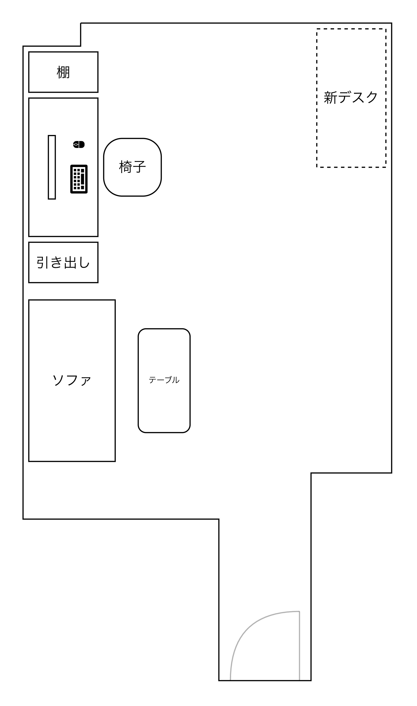

今は仕事用と趣味用（ゲーム用）でデスクが一緒。モニターは32インチの4Kモニターと25インチの320Hz・フルHDゲーミングモニターの2枚がある。

ただ、会社のMacがM3チップなので外部モニターに1画面しか出せず、仕事ではゲーム用のモニターを使っていない。逆に、ゲーム中にはモニターアームを動かして手前にゲーミングモニターを持ってきており、4Kモニターは半分くらい隠れている。キーボードとマウスもそれぞれ仕事用とゲーム用がある。

https://support.apple.com/ja-jp/101571

そのため、ゲームをする時には

1. 仕事用Macをモニターから切断する
2. ゲーミングモニターを正面に移動させる
3. キーボードを入れ替える
4. マウスを入れ替える
5. オーディオインターフェースを繋ぎかえる

の4ステップが必要になる（仕事をする時にはその逆）ため、かなり面倒。

デスクを買い足すだけでこの問題は解決しそうだと思ってる。なぜならモニター・キーボード・マウスは全て2セットあるから。椅子は……同じ部屋だし、椅子は1つでいいかなって。

## 配置イメージ

もう一つの小さな部屋を寝室にしているので、メインの部屋にはまだ余白がある（テレビも無いし）。なので、その空いたスペースに机を置こうと思う。

新デスクが仕事用になるイメージ。なぜなら、今の机の方に有線LANのポートがあり、ゲーミングPCには有線LAN必須だから。逆に仕事はWi-Fiで十分。

## 考えていること

### マイクはどうする？

今は仕事でもゲームでもAT2020を使って音声通話をしている。これはゲーム用デスクに置くことにしようと思う。仕事用は、AirPods Proのマイクは微妙だし、とはいえいちいちEarPodsを繋げるのは面倒なので、Macの内蔵マイクを使おうかなと思っている。**MacBook Proのマイクってかなり音質が良いらしい**。

https://amzn.to/4koIYJE

マイクが不要なら、オーディオインターフェースも買い足さなくて良さそう。（8年使ってるUR22MkIIから買い替えるチャンスかと思ったのに……）

### 机自体は何にする？

今はニトリのプレフェを使っていて、気に入っているのでこのままでも良いかなと思ってる。安いし（13000円）。

https://www.nitori-net.jp/ec/feature/combineablefreedeskprefee/

今使っているプレフェは幅118cm x 奥行き59cmで、足はT型タイプ。T型タイプは高さを変える機能付き（ネジ式なので、気軽には変えられない）。自分は身長が低いので、1段階下げて使っている。

幅だけ迷ってるけど、118cmは大きすぎもせず小さすぎもせずちょうど良いと思ってるので、これも同じもので良さそう。