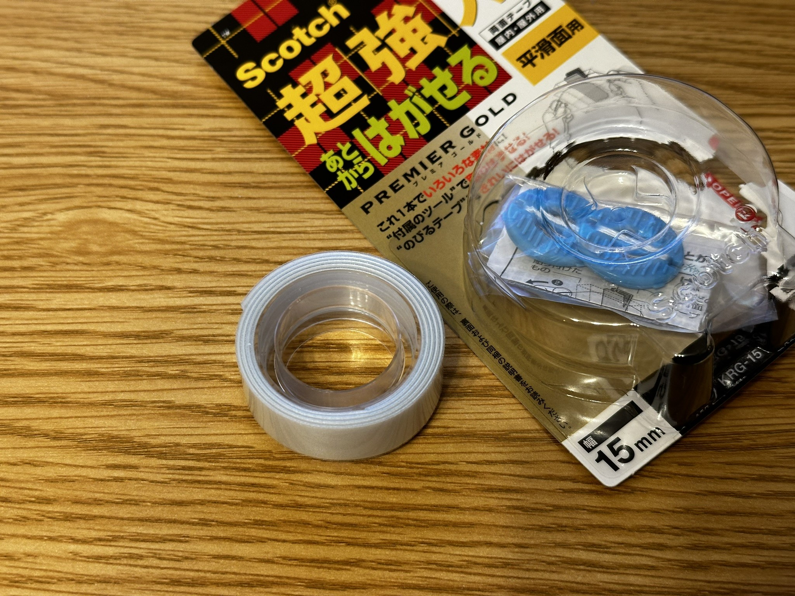
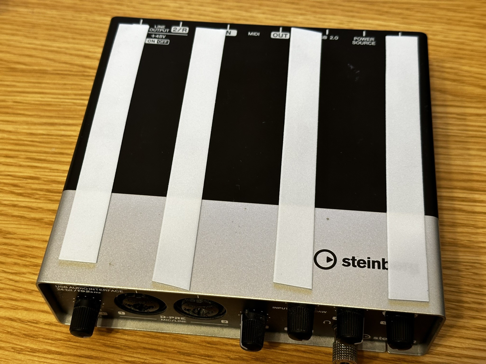
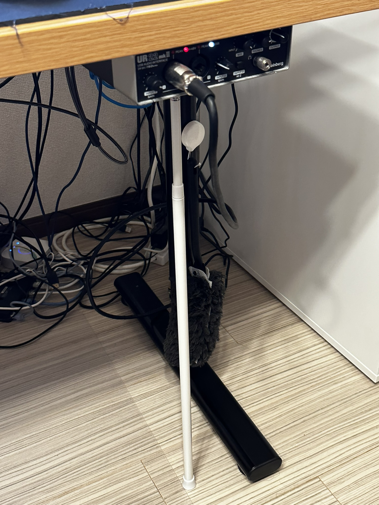

## オーディオインターフェースを机の裏に設置したい

机の上が狭いので、机の裏にオーディオインターフェースを固定してみました。ちなみに、使っているオーディオインターフェースはSteinbergのUR22mkIIです。

https://www.steinberg.net/ja/audio-interfaces/ur22c-recording-pack/ur22mkii/

実はこれまでも色々試していて、例えば[面ファスナー](https://amzn.to/3WKgHn8)を机の裏とオーディオインターフェースに貼り付けて固定してみたり、[貼り付けられる磁石シート](https://amzn.to/3WGNWrq)を使ってみたりしましたが、どれも失敗に終わっていました。

そこで、今回はもう両面テープを使って固定してしまうことにしました。ただ、完全にくっつけてしまうのは怖いので[Scotchの「あとからはがせる」シリーズ](https://amzn.to/3QRBelV)を使っています。さらに、両面テープでちゃんと固定するためにある程度の時間（約1日）は重力が掛かってほしくないので、突っ張り棒を使って仮固定しています。

## 今回やったこと

大したことはないのでダイジェストでお送りします。

これを

こうして

こうじゃ！

この状態で1日放置します。この突っ張り棒は100均で買ってきました。

にしても机の足元が汚いね…
