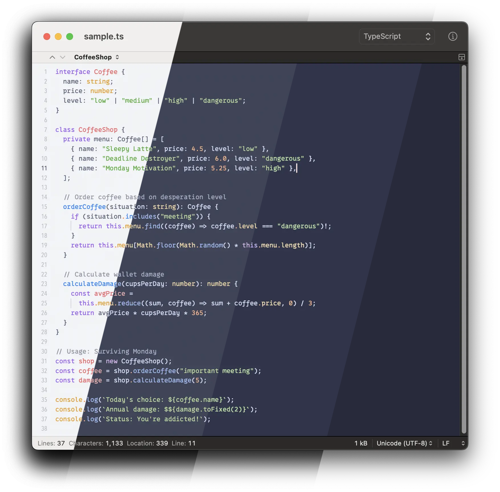

## Catppuccin

ここ数年ずっと [Dracula](https://draculatheme.com/) テーマを使っていて、最近 [Catppuccin](https://catppuccin.com/) に乗り換えた。ダーク/ライトモード両方に対応していて、パステルカラーでかわいい。

https://github.com/catppuccin/catppuccin

## CotEditorにCatppuccinテーマを

最近使い始めてお気に入りのテキストエディタが CotEditor。macOS純正のアプリであるかのような美しいUIで、使いやすい。Markdownファイルを編集するのによく使ってる。

https://coteditor.com/

ただ、調べたところCatppuccin公式ではCotEditorテーマが無い。非公式のものはあるけど、せっかくなら公式のものを使いたいよねってことで……

https://github.com/catppuccin/coteditor

自分で作ってみた。

[公式のドキュメント](https://github.com/catppuccin/catppuccin/blob/main/docs/port-creation.md#creation)に従ってリポジトリを作り、[Issue](https://github.com/catppuccin/catppuccin/issues/2829)を立てて、受けた指摘に従って修正して、リポジトリをTransferした。

https://github.com/catppuccin/catppuccin/blob/main/docs/port-creation.md

### whiskers

Catppuccinには Latte、Frappé、Macchiato、Mochaという4つのフレーバーがあり、それぞれに対応するテーマファイルを用意する必要があった。

ここで興味深かったのが、Catppuccinでは `whiskers` というコマンドが用意されていて、 `foobar.tera` のようにテンプレートファイルを用意すれば、Catppuccinのフレーバー4つ分のテーマファイルを自動生成してくれること。4つ分のテーマファイルを一つずつ手で作らなくても良いらしい。

https://github.com/catppuccin/whiskers

これのおかげで [`coteditor.tera`](https://github.com/catppuccin/coteditor/blob/main/coteditor.tera) を用意して、`whiskers coteditor.tera` を実行するだけで済んだ。すばらし～

ちなみに、 `catwalk` というのもあり、これを使うとフレーバー4つのスクリーンショットを合成して一つの画像にすることができる。

https://github.com/catppuccin/catwalk

## 初のOSS貢献

これまでIssueを立てたりコメントをしたりしたことはあったけど、コードを書いてOSSに貢献したのは初めての経験だった。OSSのOrganizationに参加したのも初めてだし、OSSのメンテナーからコードに指摘をもらったのも、メンテナーに指定されたことも初めてだった。

友達でも同僚でもない、全然知らない海外の人とコミュニケーションを取って、指摘を受けて、褒められて。楽しいかも、これ。

うーん嬉しい。