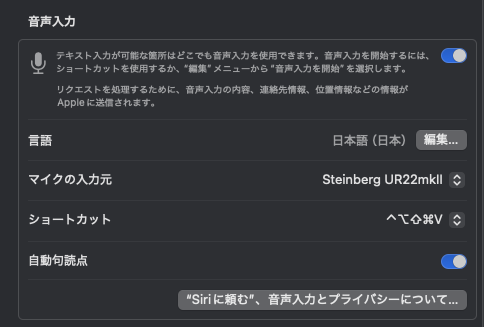
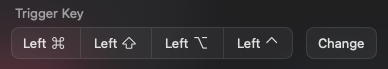
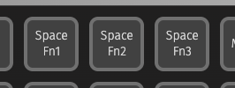
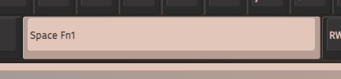

## VIA

VIAはカスタムキーボードのキーマップ設定などに使われる、ブラウザベースのソフト。

https://caniusevia.com/

### Hyperキー

Hyperキーという概念は、自分は[Raycastで知った](https://manual.raycast.com/hyperkey)が、[もっと前からあるっぽい](https://brettterpstra.com/2012/12/08/a-useful-caps-lock-key/)。とにかく、 `Command + Control + Option + Shift` の同時押しを1キーで実現することをHyperキーと呼ぶらしい。
これにより、実質的に修飾キーをひとつ増やすことができる。

VIAでは、Keymap > Special から Any を選択して、 `HYPR(KC_NO)` を設定すれば良いだけ。

https://www.reddit.com/r/Keychron/comments/17yv7nk/comment/ks710n9/?utm_source=share&utm_medium=web3x&utm_name=web3xcss&utm_term=1&utm_content=share_button

https://docs.qmk.fm/feature_advanced_keycodes#modifier-keys:~:text=and%20press%20kc-,HYPR(kc),-Hold%20Left%20Control

例えばMacの音声入力キー。ここに `Hyper+V` を設定した。ちなみに、今のところDictation（音声入力）キーのQMKキーコードは無いっぽい。

他にも、ウィンドウ操作アプリのLoopではTriggerキーとしてHyperキーを設定したり。

https://github.com/MrKai77/Loop

### Spaceキーをレイヤーキーとして使うと便利

Spaceキー単押しの時はSpaceキーとして使って、他のキーと組み合わせて使ったときだけレイヤー切り替えキーとして動作するようにすると便利。実際、VIAにはこれ専用のキーがある。これをスペースキーに割り当てれば良いだけ。

