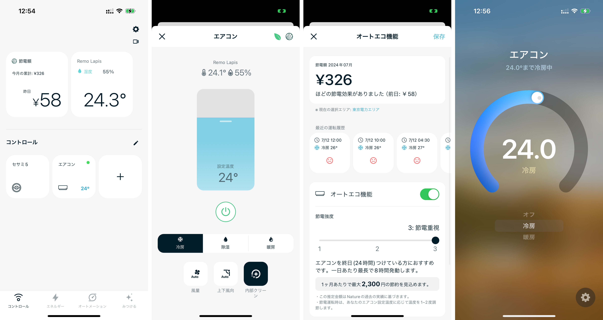
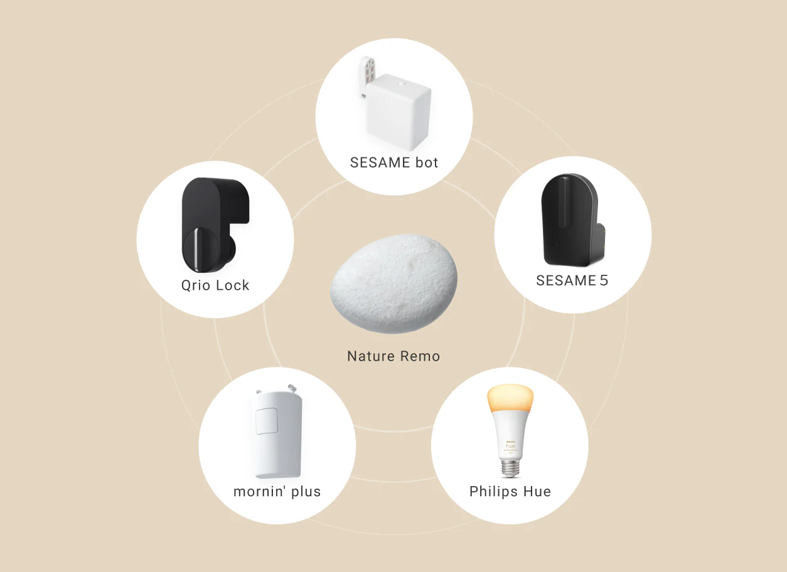
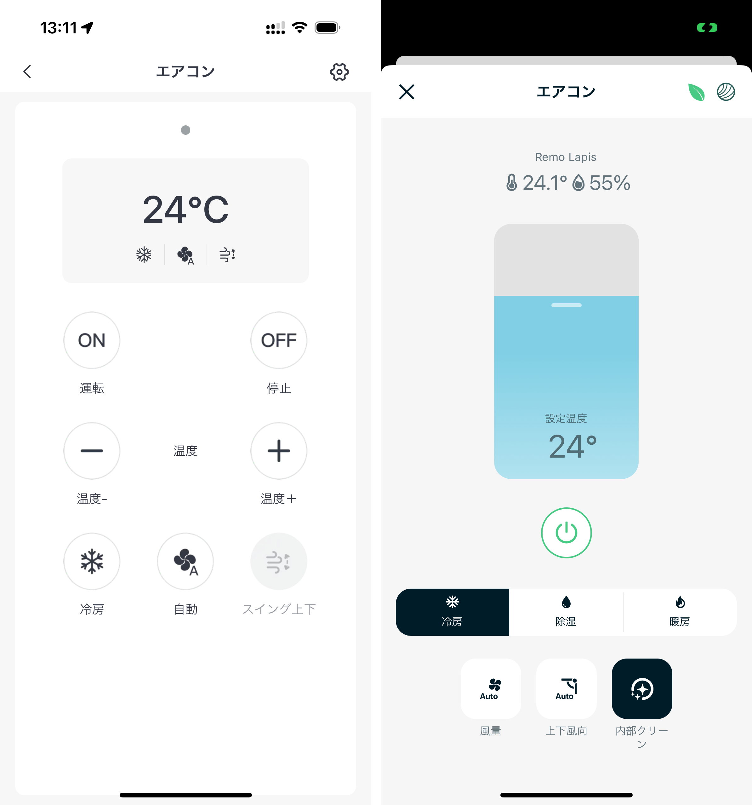

## Nature Remo Lapisを買ってみた

Nature Remo Lapisは、その本体の小石のような見た目と、内蔵された温湿度計を使ってエアコンの設定を自動で最適化するオートエコ機能が特徴です。今回は公式サイトからの予約限定で1000円引きの6980円になっていたので、そこから購入しました。

https://shop.nature.global/products/nature-remo-lapis

https://amzn.to/3Wkj6EC

### オートエコ機能

オートエコ機能は思ったよりいい感じで、室温と時間帯に応じてエアコンの設定を自動で最適化して、快適性と省エネのバランスを取ってくれます。節約額の目安はアプリのホーム画面にも表示され、効果が分かりやすいのが良い感じです。

### Matter

オートエコ機能以外にも期待していた機能があります。それが、Matter対応と、Candy HouseのスマートロックであるSesame 5との接続機能です。Nature Remo Lapisはサードパーティー機器との接続も謳っており、その中にSesame 5も含まれています。

Matter対応により、このSesame 5をAppleホームアプリから操作できるようになることを期待していましたが、残念ながらNature Remo LapisをMatter経由でAppleホームアプリに接続しても、Sesame 5は連携されませんでした。Nature HomeのアプリからはSesame 5を操作できますが、それであれば別にセサミアプリを使えば良いかなという印象です。

ただ、Matter対応によりHomebridgeを介さずともAppleホームアプリからエアコンを操作できるようになったのは単純に素晴らしいです。特にSiriから操作できるのが最高ですね。

### スマートリモコンとして

これまで使っていたSwitchBotハブミニと比較しながらNature Remo Lapisを見ていこうと思います。まずリモコンの登録については、どちらもリモコンを本体の近くで操作するだけでほぼ完了し、大きな差は感じられませんでした。

#### 操作画面

左のSwitchBotはリモコンのボタンをそのままアプリに持ってきているようなデザインです。右のNature Homeアプリはそれとは少し違っていて、まず中央に温度調節のスライダーがあり、その下には各ボタンが機能ごとに配置されている感じです。温度のスライダーの上に実際の今の室温と湿度が表示されるというのが気が利いているなと感じました。

また、これはエアコンの機種によると思うのであまり一般的な話ではないかもしれませんが、自分のエアコンには内部クリーンという機能があり、このボタンがNature Homeアプリでは表示されるのが地味に嬉しいポイントでした。いちいちオンオフするような機能では無いので大した問題ではないのですが、SwitchBotアプリではそれが表示されないのが少し気になっており、Nature Remoではそういった細かいところまで気を遣って対応しているのが好印象でした。

## まとめ

Sesame 5連携については期待外れでしたが、オートエコ機能には今のところ満足しています。Matter対応で本体デザインも良く、アプリの操作感も良いので、このまま使い続けていこうと思います。

https://shop.nature.global/products/nature-remo-lapis

https://amzn.to/3Wkj6EC
