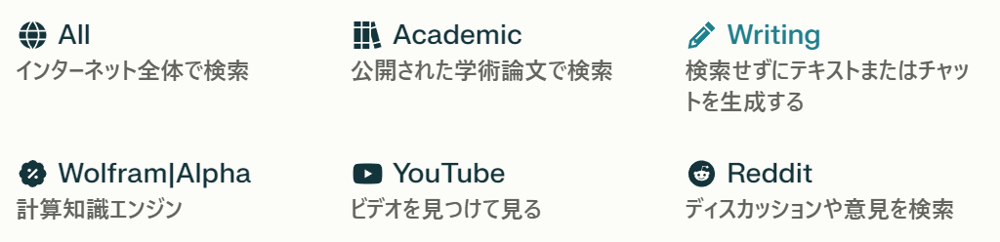
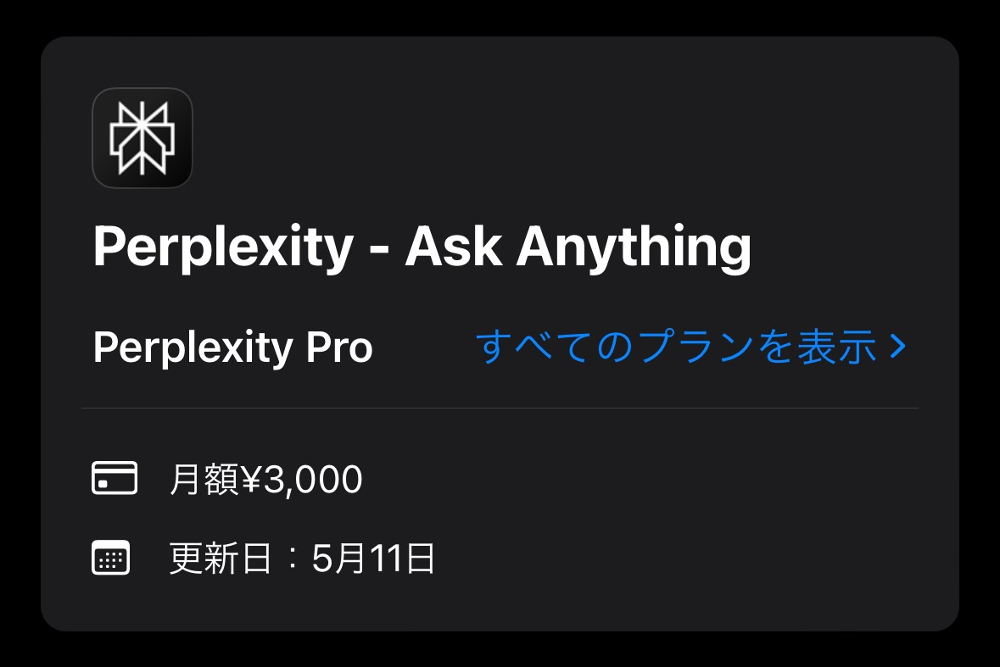

## $20.00 + $20.00 + $20.00 + ...

先月OpenAIの[ChatGPT](https://chat.openai.com/)からAnthropicの[Claude 3](https://claude.ai/chats)に乗り換えましたが、時々Claude 3 OpusとChatGPTのGPT-4 Turboを比較したくなります。しかし、それぞれ20ドルで合計40ドルは支払いたくありません。そこで、Perplexity Proの契約を検討しました。

https://claude.ai/chats

AIツールの標準月額価格=20ドルというような風潮ができつつあり、一つ契約するたびに月額3000円かかるのは本当につらいですね。先日もCursor Proを契約しようとして、20ドルという価格を見て断念してしまいました。

https://cursor.sh/pricing

## Perplexity Pro

PerplexityはAIモデルを使った強力な検索ツールくらいに思っていたのですが、Writingモードに変更すればChatGPTやClaudeのようなテキスト・チャット生成ツールとして使うこともできることがわかりました。



また、Perplexityの有料プランであるPerplexity Proに契約すると、GPT-4 TurboやClaude 3 Opusなどの強力なAIモデルを利用できるようになります。つまり、ChatGPT PlusやClaude Proを別々に契約することなく、Perplexity Pro一つでこれらのAIモデルを利用できるわけです。ただ、ChatGPTとは違いコード実行や様々なプラグインを活用することはできないため、その点には注意が必要です。

https://perplexity.ai/pro?referral_code=9RY9B1DG

## iOSアプリ内課金のほうが若干安かった

Perplexity Proはウェブで契約すると月額20ドルですが、iOSアプリ内課金では月額3000円に設定されています。2024年4月14日現在、20ドルは約3,065円なので、iOSアプリ内課金で契約する方が若干安くなります（円安……）。



一般的には、ウェブからの契約とiOSアプリ内課金が用意されているサービスでは、iOSアプリ内課金の方が高いことが多い（Appleの手数料が原因）ところ、円安のせいかここでは逆転しているようです。

## Perplexityのフォントを変更する

Perplexityのデフォルトのフォントの設定ではカギかっこの表示が崩れます。おそらく、最近のChromeの仕様変更に関わる問題が原因のようです。

https://zenn.dev/inaniwaudon/scraps/f224417d4c51ee

これを避ける意味も含めて、[Amino](https://aminoeditor.com/)を使ってユーザーCSSを追加しました。今回は、Google Fontsから[BIZ UDPGothic](https://fonts.google.com/specimen/BIZ+UDPGothic)を読み込んで使うことにしました。

```css
@import url('https://fonts.googleapis.com/css2?family=BIZ+UDPGothic:wght@400;700&display=swap');

html,
.font-display,
.font-sans {
  font-family: 'BIZ UDPGothic', sans-serif;
}
```

https://aminoeditor.com/

https://fonts.google.com/specimen/BIZ+UDPGothic
