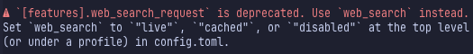

NeovimでClaude CodeやCodexなどを使うために [sidekick.nvim](https://github.com/folke/sidekick.nvim/) を使っているのですが、Codexを使った際に

```plaintext
[features].web_search_request` is deprecated. Use `web_search` instead
```

というエラーが表示されます。



このエラーは sidekick.nvim の `lua/sidekick/config.lua` で `--enable web_search_request` が付加されていることによって起こっています。

```lua:lua/sidekick/config.lua:106
codex = { cmd = { "codex", "--enable", "web_search_request" } },
```

<https://github.com/folke/sidekick.nvim/blob/c2bdf8cfcd87a6be5f8b84322c1b5052e78e302e/lua/sidekick/config.lua#L106>

> [!INFO]
> `--enable web_search_request` はCodexがウェブ検索できるようにするためのオプションです。ただ、[現在のCodexはウェブ検索がデフォルトで有効化されている](https://developers.openai.com/codex/changelog/#codex-2026-01-28-mdx)ため、このオプションは不要になりました。

<https://developers.openai.com/codex/changelog/#codex-2026-01-28-mdx>

## 回避策（workaround）

sidekick.nvim の設定で `cli.tools.codex.cmd` を上書きし、シンプルに `codex` のみにします。

```lua:lua/plugins/sidekick.lua
return {
  {
    "folke/sidekick.nvim",
    config = function()
      require("sidekick").setup({
        cli = {
          tools = {
            codex = {
              cmd = { "codex" },
            },
          },
        },
      })
    end,
  },
}
```

## 根本的な修正

[folke/sidekick.nvim](https://github.com/folke/sidekick.nvim/) に向けてこの問題を解消するためのPRを作成しましたが、 folke/sidekick は最近あまり更新されていないようで、いつマージされるか不明です。そのため、この記事を作成しました。

<https://github.com/folke/sidekick.nvim/pull/257>

## 参考

<https://github.com/folke/sidekick.nvim/>

<https://github.com/folke/sidekick.nvim/pull/257>

<https://developers.openai.com/codex/cli/features/#web-search>

