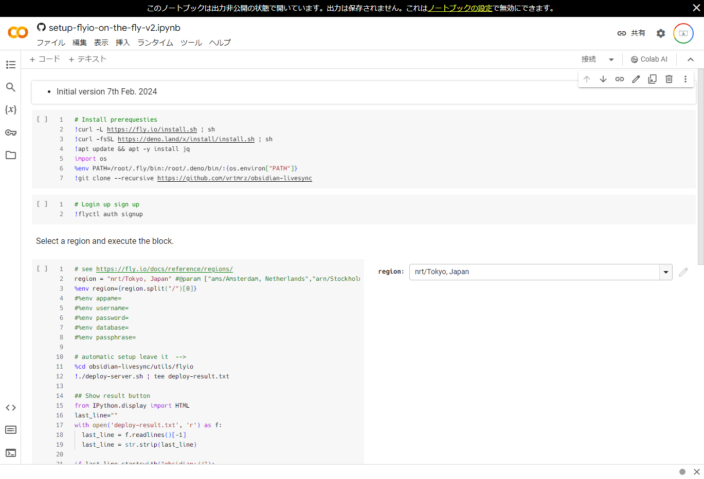
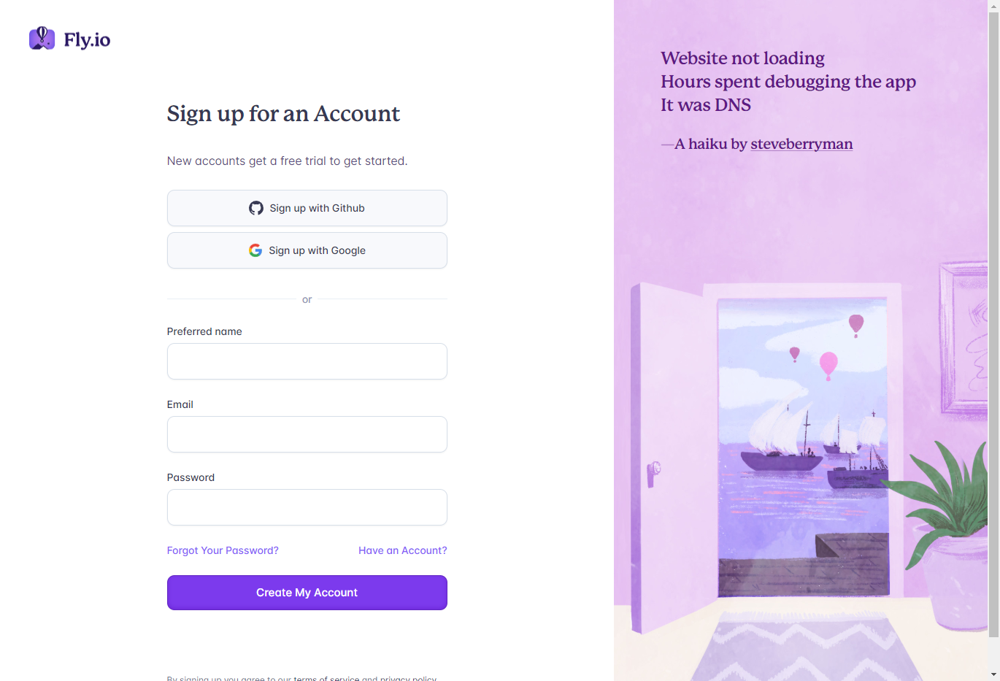
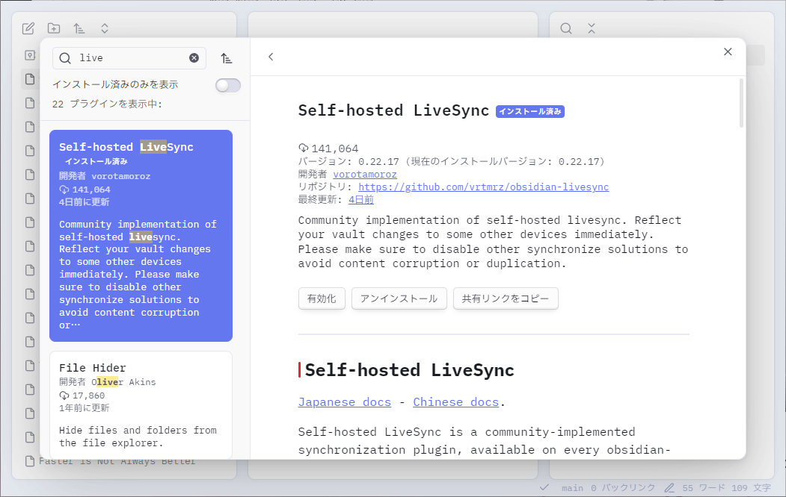
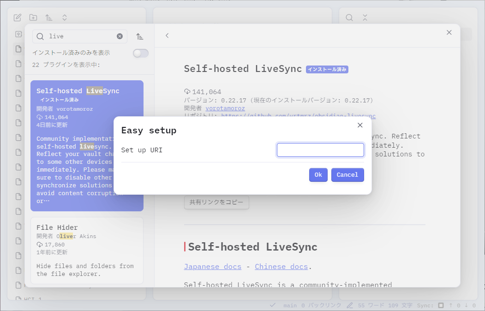

## Obsidian Sync

メインのPCがMacからWindowsに変わったために、Obsidianの同期方法を再検討しました。これまではiCloudによる同期を使っていましたが、Windows版のiCloudはあまり信用していないため、他の手段を探す必要があります。

Obsidianが公式に提供している同期サービスObsidian Syncには、主にSyncとSync Plusの2つのプランがあります。Sync Plusには容量が100GBのプランもあり、通常のSync Plusの倍額に設定されています。

|                               | Sync                   | Sync Plus               |
| ----------------------------- | ---------------------- | ----------------------- |
| **料金**                      | 月額5ドル / 年額48ドル | 月額10ドル / 年額96ドル |
| **最大vault数**               | 1                      | 10                      |
| **容量**                      | 1GB                    | 10GB                    |
| **1ファイル当たり最大サイズ** | 5MB                    | 200MB                   |
| **バージョン管理**            | 1カ月                  | 12カ月                  |

<p class="text-right">（2024年4月15日現在）</p>

https://obsidian.md/sync

Obsidian Syncは公式サービスであることから、安定していることが期待されますが、1GBの容量は画像などを含む文書を扱うには心許ないサイズです。10GBあれば当面は困らないかもしれませんが、ノートアプリに月額10ドルは高すぎます。

## Self-hosted LiveSync

そこで、色々と調べた結果、ObsidianのコミュニティプラグインであるSelf-hosted LiveSyncを使ってみることにしました。Self-hosted LiveSyncは、ObsidianのvaultをCouchDBのサーバを使って同期するプラグインです。

https://github.com/vrtmrz/obsidian-livesync/tree/main

上記GitHubの[How to use](https://github.com/vrtmrz/obsidian-livesync/tree/main?tab=readme-ov-file#how-to-use)を参考にし、fly.ioを使ってCouchDBのサーバを立ち上げ、Self-hosted LiveSyncを使ってみました。

fly.ioでは無料でCouchDBのサーバを立ち上げることができ、3GBの容量が無料で与えられます。3GBを超える場合、1GBあたり0.15ドルの月額料金がかかります。

https://fly.io/

### 1. CouchDBの設定

Self-hosted LiveSyncの設定ドキュメントに自動セットアップスクリプトが用意されているため、それを利用してCouchDBのサーバを立ち上げていきます。

この手順は、Self-hosted LiveSyncの作成者による動画がYouTubeにアップされているため、そちらを参考に進めていきます。

https://www.youtube.com/watch?v=7sa_I1832Xc

1. まず、[setup-flyio-on-the-fly-v2.ipynb](https://github.com/vrtmrz/obsidian-livesync/blob/main/setup-flyio-on-the-fly-v2.ipynb) を開き、 `Open in Colab` をクリックします。
   すると、Google Colabが開かれます。そこで、regionを `nrt/Tokyo, Japan` に設定します（日本の場合）。

   （今回は最初から`nrt/Tokyo, Japan`になっていたので、何も弄らずに進めました）

   

2. regionを選択したら、各セルを上から順番に実行していきます。
   なお、最後の`!./delete-server.sh` のセルを実行すると、立ち上げたサーバインスタンスが削除されるため、注意してください。

   1. `# Install prerequesties` のセルを実行し、依存関係のインストールが行います。
   2. `Login up sign up` のセルを実行すると、fly.ioにログインするためのリンクが表示されます。表示されるリンクをクリックしてログインします。fly.ioのアカウントが無い場合は、ここでアカウントを作成します。

      

      ログインすると、Google Colabのセルの実行結果に `successfully logged in as name@example.com` のように表示されます。

   3. サーバを立ち上げる前に、fly.ioに支払い情報を登録しておく必要があります。登録せずにサーバを立ち上げようとすると、エラーが表示されます。fly.ioのダッシュボードの**Billing**ページから、Hobby Planを選び、支払い情報を登録します。ここで登録すると、5GBの無料クレジットがアカウントに追加されます。この登録では支払いは発生しません。
   4. 支払い情報を登録出来たら、`# see https://fly.io/docs/reference/regions/` から始まるセルを実行すると、CouchDBのサーバが立ち上がります。
   5. サーバインスタンスの立ち上げが完了すると、以下のような形式でセットアップ用のURIと、そのコピーボタン、セットアップ用パスワードが表示されます。この情報は、Obsidianの設定で使います。再度表示することができないため、メモしておきます。

      ```plaintext
      --- setup uri ---
      obsidian://setuplivesync?.......
      Copy your setup-URI with this button! -> Copy setup uri
      Importing passphrase is `*****`.
      If you want to synchronise in live mode, please apply a preset after ensuring the imported configuration works.
      ```

### 2. Obsidianの設定

CouchDBのサーバが立ち上がったら、ObsidianのSelf-hosted LiveSyncの設定を行います。以下の手順をPC版ObsidianとiOS版Obsidianの両方で行うことで、同期を開始することができます。

1. Obsidianの設定画面から、**コミュニティプラグイン**を開き、**閲覧**をクリックして、**Self-hosted LiveSync** をインストールします。

   

2. Self-hosted LiveSyncをインストールしたら、**有効化** をクリックして有効化します。すると、ポップアップが開かれるため、一番下の **Use the copied setup URL** クリックします。
   
3. 先ほどのセットアップ用のURIを貼り付けて、**Ok**をクリックします。
4. パスワードを求められるので、先ほどのセットアップ用パスワードを入力し、**Ok**をクリックします。
5. `Importing LiveSync's conf, OK?` と表示されるので、**OK**をクリックします。
6. `How would you like to set it up?` と表示されたら、 **Set it up as secondary or subsequent device** を選択すると、初期設定が開始されます。
7. `Hidden file sync` のポップアップが表示されますが、これは **keep them disabled** を選択します。

## Obsidian Git

Self-hosted LiveSyncでは同期はできますが、何らかの要因でデータが消えてしまう不安があるため、Obsidian Gitを使ってバックアップを取ることにしました。これはPC版Obsidianのみに設定しました。また、基本的にバックアップのみが目的のため、定期実行はCommitとPushのみとし、定期的なPullは無効化しました。

https://github.com/denolehov/obsidian-git

## 参考にしたサイトなど

https://note.com/wolf_horo/n/n94388d45a83e

https://zenn.dev/ayumukob/articles/3b034fcb6874d2

https://github.com/vrtmrz/obsidian-livesync/blob/main/README.md
