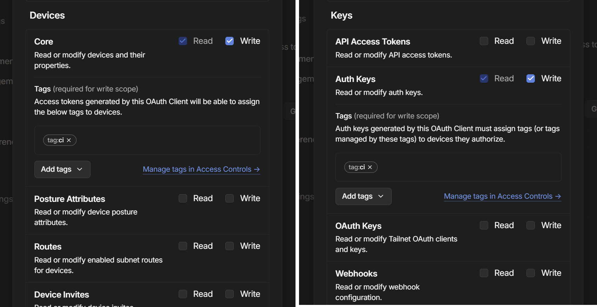
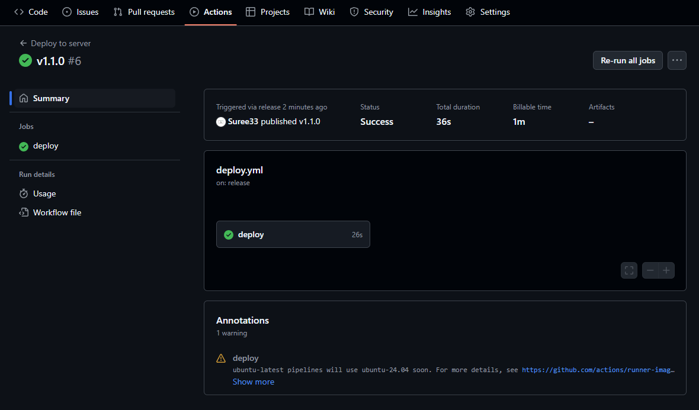

## palworld-server-docker

自宅のミニPCでPalworldのサーバーを立てて遊んでいます。
使っているのは [`thijsvanloef/palworld-server-docker`](https://github.com/thijsvanloef/palworld-server-docker) とDocker Composeで、設定に使っているのは基本的に`docker-compose.yml` のみです。

https://github.com/thijsvanloef/palworld-server-docker

そのため、何か設定を変える場合（パルタマゴの孵化時間を変えるなど）は以下の手順で行っていました。

1. `docker-compose.yml` を書き換える
2. `docker compose down && docker compose up -d`

設定ファイルはGitHubで管理していたのに、デプロイの時はSSHしてからコマンドを打つという非効率な方法だったので、これをGitHub Actionsで自動化します。今回は、Releaseを作成した時に自動でデプロイするようにします。

前提：サーバーのPCにはTaiscaleを設定済みです。友人がサーバーにアクセスする際にもTailscale経由で接続しています。

GitHub ActionsからTailscale経由でサーバーにアクセスするために、Tailscale公式の [`tailscale/github-action`](https://github.com/tailscale/github-action) を使います。

https://github.com/tailscale/github-action

https://tailscale.com/kb/1276/tailscale-github-action

## Tailscaleの設定

TailscaleのAdmin Consoleから設定を行います。

### ACLの設定

Access Controlsに追記して、タグを追加します。

```diff
 "tagOwners": {
+    "tag:ci": ["autogroup:admin"],
 },
```

```diff
 "acls": [
     {"action": "accept", "src": ["*"], "dst": ["*:*"]},
+    {"action": "accept", "src": ["tag:ci"], "dst": ["tag:ci:*"]},
 ],
```

### デバイスにタグを追加

Machinesからデプロイ先のサーバーを選択して、Machine settings > Edit ACL tags...から、上で設定したタグ（今回は `tag:ci`）を追加します。

### OAuth clientsを追加

[Settings > OAuth clients](https://login.tailscale.com/admin/settings/oauth) から新しいOAuth clientを追加します。

必要な権限は `Devices > Core` の `Read` / `Write` の両方と、 `Keys > Auth Keys` の `Read` / `Write` の両方です。ここで [Auth Keysが必要なこと](#oauth-clientsのauth-keys権限)に気が付かず少しハマりました。

Tagsには、先ほど設定したタグを指定します。



`Generate client` をクリックして、表示された `Client ID` と `Client Secret` を控えておきます。

## GitHub Actionsの設定

リポジトリの Settings > Secrets and variables > Actions > New repository secret から、 `TS_OAUTH_CLIENT_ID` と `TS_OAUTH_CLIENT_SECRET` を追加し、それぞれ先ほど控えた `Client ID` と `Client Secret` を入力します。

さらに、SSH用の情報もSecretsに追加しておきます。

- `SSH_HOST`: Tailnet上のサーバーのIPアドレス（Admin Consoleなどから確認できる）
- `SSH_USERNAME`: SSHのユーザー名
- `SSH_KEY`: SSHの秘密鍵

GitHub Actionsの設定ファイル `.github/workflows/deploy.yml` を作成します。

```yaml:deploy.yml
name: Deploy to server
on:
  release:
    types: [published]
jobs:
  deploy:
    runs-on: ubuntu-latest
    environment:
      name: Deploy
    steps:
      - name: Setup Tailscale
        uses: tailscale/github-action@v3
        with:
          oauth-client-id: ${{ secrets.TS_OAUTH_CLIENT_ID }}
          oauth-secret: ${{ secrets.TS_OAUTH_SECRET }}
          tags: tag:ci
      - name: Deploy
        uses: appleboy/ssh-action@master
        with:
          host: ${{ secrets.SSH_HOST }}
          username: ${{ secrets.SSH_USERNAME }}
          key: ${{ secrets.SSH_KEY }}
          script: |
            cd /path/to/directory/palworld
            git fetch --all
            git checkout ${{ github.event.release.tag_name }}
            docker compose down
            docker compose up -d
```

SSHは [`appleboy/ssh-action`](https://github.com/appleboy/ssh-action) を使います。ここに特にこだわりはありません。

これで、Releaseを作成すると自動でデプロイされるようになりました。

タグを切ってGitHubからReleaseを作成すると、自動でActionsがTailnet経由でサーバーにアクセスし、リリースのタグで `docker compose down && docker compose up -d` を実行してくれます。

```bash
git tag -a v1.0.0 -m "Release v1.0.0"
git push --tags
```



あら便利。

## ハマったところ

### OAuth ClientsのAuth Keys権限

`OAuth Clients` のところで、多くの解説記事では `Devices` の `Read` / `Write` のみで動作すると書かれており、ここでハマりました。

Tailscale Docsの [OAuth Clients](https://tailscale.com/kb/1215/oauth-clients#generating-long-lived-auth-keys) にあった以下の記述から、「これ、Auth Keysの権限も要るんじゃないか…？」と追加してみたら動きました。

> Instead of a long-lived auth key, you can generate an OAuth client with the `auth_keys` scope. Use the OAuth client to generate new auth keys as needed, by making a POST request to the `/api/v2/tailnet/:tailnet/keys` API method. When you create an OAuth client with the scope auth_keys, you must select one or more `tags`, which can be any tag or set of tags in your tailnet. Additionally, these tags need to be specified in the API call.

https://tailscale.com/kb/1215/oauth-clients#generating-long-lived-auth-keys

2024年11月14日からOAuth Clientsのスコープが変わったようです。

> As of November 14, 2024 new OAuth clients will use the scopes listed in the scopes section. Existing OAuth clients using the below scopes, and keys generated using these clients, are still valid.

https://tailscale.com/kb/1215/oauth-clients#legacy-scopes