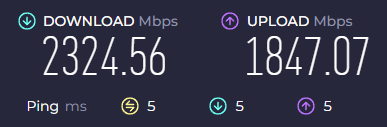

## XG-100NEは不安定

おてがる光クロスをここ数ヶ月利用している。ルーターはXG-100NEのレンタル。速度は上限近くまで出ていて文句なし（PCのマザボが2.5Gbpsまでの対応）。前の家は電話線を使ったVDSL方式で100Mbpsが関の山だったので、本当に感動レベルで快適になった。



しかし、とにかく不安定。Valorantなどのゲームをしていると、接続が不安定なことを示す表示がほとんど常に表示される。実際、武器の切り替えが遅れることも。

192.168.1.1 からXG-100NEの設定画面を開いて障害ログを見てみると、`ポートリンクダウン` のログが多数記録されている。

```log
24. 2025-02-02 14:19:12 LAN2 ポートリンクアップ
25. 2025-02-02 14:19:09 LAN2 ポートリンクダウン
26. 2025-02-02 14:19:06 LAN4 ポートリンクアップ
27. 2025-02-02 14:19:06 LAN2 ポートリンクアップ
28. 2025-02-02 14:19:03 LAN2 ポートリンクダウン
29. 2025-02-02 14:18:51 LAN2 ポートリンクアップ
30. 2025-02-02 14:18:48 LAN4 ポートリンクダウン
31. 2025-02-02 14:18:45 LAN2 ポートリンクダウン
32. 2025-02-02 14:17:18 LAN4 ポートリンクアップ
33. 2025-02-02 14:17:12 LAN4 ポートリンクダウン
34. 2025-02-02 14:17:06 LAN4 ポートリンクアップ
35. 2025-02-02 14:17:01 LAN4 ポートリンクダウン
36. 2025-02-02 14:16:30 LAN4 ポートリンクアップ
37. 2025-02-02 14:15:44 LAN2 ポートリンクアップ
38. 2025-02-02 14:15:38 LAN2 ポートリンクダウン
39. 2025-02-02 14:15:37 LAN2 ポートリンクアップ
40. 2025-02-02 14:15:32 LAN2 ポートリンクダウン
41. 2025-02-02 14:15:31 LAN2 ポートリンクアップ
42. 2025-02-02 14:15:28 LAN2 ポートリンクダウン
43. 2025-02-02 14:15:23 LAN2 ポートリンクアップ
44. 2025-02-02 14:15:15 LAN2 ポートリンクダウン
45. 2025-02-02 14:15:10 LAN3 ポートリンクダウン
46. 2025-02-02 14:15:10 LAN1 ポートリンクダウン
```

「XG-100NE 不安定」などと色々調べてみて出てきた色々な対策を試してみたが、改善なし。実際、多くの記事では対策による効果は一時的なもので、根本的な解決にはならないと書かれている。XG-100NEを使っている限り未来はないらしい。

<https://ameblo.jp/minami-ku/entry-12842760456.html>

<https://note.com/8mtar0/n/nbc2a334833d3>

<https://www.rocomotion.net/xg100ne-network-settings/>

## TP-Link BE450（BE7200）を購入

10Gbps対応でv6プラスにも対応しているルーターを探し、さらにWi-Fi 7対応だったTP-LinkのBE450（BE7200）を購入した。価格は18,720円。LAN側のポートは2.5Gbpsまでだが、どうせPC側も2.5Gbpsまでしか対応していないので問題なし。10Gbps対応のLANカードを買うときにまた検討しようかな。

<https://www.amazon.co.jp/dp/B0DG1JKNTQ?th=1&linkCode=ll1&tag=thisissuree-22&linkId=6a7b955e78cc78513c9a016d67f4f9d5&language=ja_JP&ref_=as_li_ss_tl>

### 繋げてみる

ONU（10G-ONU）からXG-100NEに繋げていたLANケーブルをBE450に繋げて、初期設定を進める。Tetherアプリを使って設定を始めると、ONUは再起動した方がいいとあるので、その通りにする。念の為、電源を抜いてから5分ほど放置してから電源を入れる。

おてがる光の接続方式はv6プラスなのでv6プラスを選択し、他は基本的にデフォルトのまま進める。これで繋がるはずだが、繋がらない。
