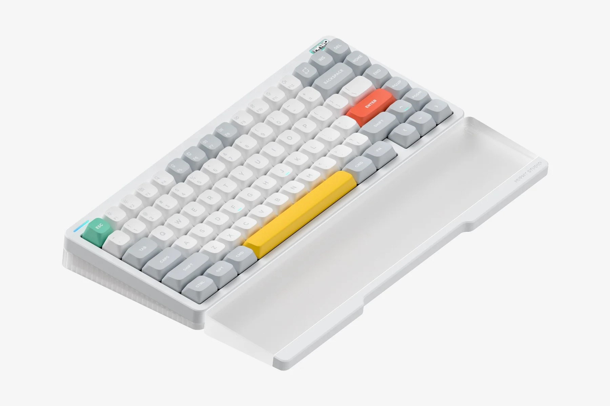
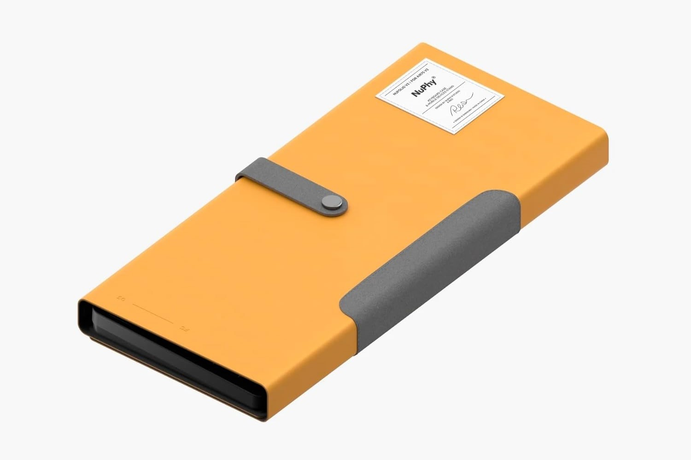

## PC周り

### Logicool MX Master 3s

価格: ¥16,900

4年使ったMX Master 3から買い換えたい。

https://sur33.com/posts/logi-mx-master-is-better-than-lift

https://www.logicool.co.jp/ja-jp/products/mice/mx-master-3s.910-006568.html

https://amzn.to/3Um98Bq

### Nuphy Halo75 V2

価格: $148.95

Nuphy Halo75の後継機。新しいキーキャップのプロファイルが気になる。20000円台でクオリティの高いキーボードを買えるのは魅力的。

https://nuphy.com/products/halo75-v2-qmk-via-wireless-custom-mechanical-keyboard?variant=41197390069869

### Nuphy NuFolio V3 for Air75

価格: ¥3,520

NuPhy Air75用のケース。キーボードを裸で持ち歩きたくないので、ケースが欲しい。これは純正のケースで、キーボードにピッタリフィットするので便利そうだし、見た目がすごく良い。

https://amzn.to/4aJrlik

https://nuphy.com/products/air75

### DDR5-4800 メモリ

価格: 約¥15,000

デスクトップPCのメモリが現状32GBで、WSLなどを使っているとメモリが足りなくなることがある。32GB+32GBで64GBに増設したい。

https://amzn.to/3Q7YtYG

### CIO マグネットシリコンケーブル

¥1,850

デスク上でキーボードやマウスなどを充電する際に抜き差しが面倒なので、マグネットケーブルが欲しい。CIO製だし結構良さそう。

https://connectinternationalone.co.jp/cioproduct/cable/%e3%83%9e%e3%82%b0%e3%83%8d%e3%83%83%e3%83%88%e3%82%b1%e3%83%bc%e3%83%96%e3%83%ab%e3%82%b7%e3%83%aa%e3%83%bc%e3%82%ba/s_cio-slmg-cc05/

https://amzn.to/49HtI3R

## PC周り（ゲーム）

### Pulsar ParaBrake V2 XL Black

価格: ¥2,490

マウスパッドを買い換えたい。これくらい安いやつを定期的に買い換えていきたい。

https://pulsargg.jp/products/para-brake-v2-mouse-pad-xl-slow-speed?variant=47283642171685

https://amzn.to/3Q5D3eI

## スマートホーム

### Philips Hue フルカラー シングルランプ E26 1600lm

価格: ¥6,423

今は800lmのホワイトシングルランプを使っていて、フルカラーのHueを使ってみたい & 1600lmが気になる。ただ、[4つ買う](https://amzn.to/441r6fS)と結構な金額になるので、悩んでいる。

https://www.philips-hue.com/ja-jp/p/hue-white-and-color-ambiance-a21---e26-smart-bulb---1600/8719514360808

https://amzn.to/3JmNbfj

### SwitchBot ハブミニ(Matter対応)

価格: ¥5,980

SwitchBotデバイスは[Homebridgeプラグイン](https://github.com/OpenWonderLabs/homebridge-switchbot)でもHomeKit対応できるが、ロボット掃除機が照明として認識されるのが不満。Matter対応のハブミニなら、HomeKitで正しく認識されるっぽい。

https://www.switchbot.jp/products/switchbot-hub-mini-matter

https://amzn.to/3vMod61
